# AI Chatbot with RAG on Azure

An AI-powered chatbot with two modes — general Q&A and document-based Q&A using Retrieval-Augmented Generation (RAG). Built with FastAPI and Streamlit, containerized with Docker, and deployed on **Azure Container Apps**.

### 🌐 Live Demo
**[Try the App](https://ai-rag-frontend.wittymushroom-cab33f1c.swedencentral.azurecontainerapps.io)**

---

## Architecture

---

## Features

1. **General Query** — Ask any question; answered directly by Llama 3.3 (70B Instruct) via Azure AI.
2. **Document RAG** — Upload a PDF or TXT file; the chatbot indexes it with Cohere embeddings and answers questions using only that document's content.
3. **Microservices Architecture** — Decoupled FastAPI backend and Streamlit frontend, each in its own container.
4. **Persistent Vector Store** — ChromaDB stores embeddings on disk so the index survives container restarts.
5. **CI/CD Pipeline** — Every push to `main` builds, pushes to GHCR, and deploys to Azure Container Apps automatically.

---

## Backend Endpoints

| Method | Path | Purpose |
|--------|------|---------|
| POST | `/upload-document/` | Upload PDF/TXT and build ChromaDB vector index |
| POST | `/document-query/` | RAG-based Q&A against uploaded document |
| POST | `/general-query/` | Direct LLM Q&A (no document context) |
| GET | `/status/` | Check if a document is currently loaded |
| GET | `/clear-index/` | Delete ChromaDB collection and reset state |

---

## Technology Stack

| Layer | Technology |
|-------|-----------|
| Backend framework | FastAPI (Python 3.11) |
| Frontend framework | Streamlit |
| LLM | Llama 3.3 (70B Instruct) via Azure AI |
| Embeddings | Cohere via Azure AI |
| RAG framework | LlamaIndex |
| Vector store | ChromaDB (persistent) |
| Production server | Gunicorn + Uvicorn workers |
| Containerization | Docker (python:3.11-slim) |
| Container registry | GitHub Container Registry (GHCR) |
| Hosting | Azure Container Apps — Sweden Central |
| CI/CD | GitHub Actions |

---

## CI/CD Pipeline

Push to `main` triggers GitHub Actions:
1. Build Docker image for backend or frontend
2. Push to GitHub Container Registry (`ghcr.io/magesh-babu/backend:<sha>` or `frontend:<sha>`)
3. Deploy to Azure Container Apps in resource group `resource_apr_2026` (Sweden Central)

**Required GitHub Secrets:**

| Secret | Purpose |
|--------|---------|
| `AZURE_CREDENTIALS` | Service principal JSON for Azure login |
| `GHCR_PAT` | Personal Access Token with `read:packages` scope |
